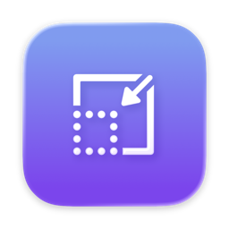
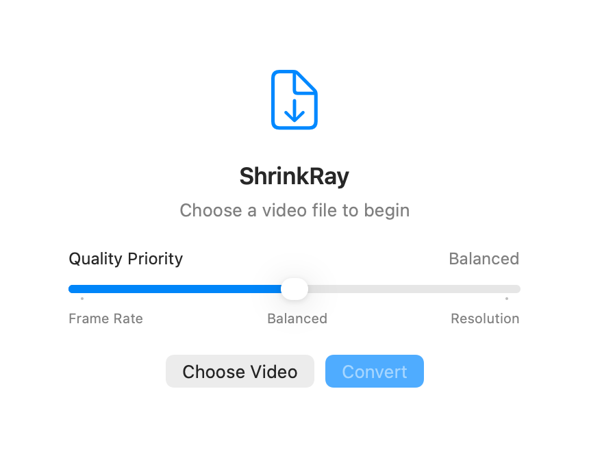

# ShrinkRay

<p align="center">
  
</p>

<p align="center">
  <picture>
    <source media="(prefers-color-scheme: dark)" srcset="docs/AppScreenshotDark.png">
    <source media="(prefers-color-scheme: light)" srcset="docs/AppScreenshot.png">
    
  </picture>
</p>

ShrinkRay is a native macOS app that converts one local video at a time into a Discord-sized MP4. Processing stays on your Mac; nothing is uploaded.

## Requirements

- macOS 15 or later
- Xcode 26 or later with Swift 6 and Icon Composer support
- [Homebrew](https://brew.sh/), FFmpeg, and FFprobe

Install the full runtime to support standards-based HDR conversion:

```sh
brew install ffmpeg-full
```

The regular `brew install ffmpeg` build works for SDR sources, but it does not include `libplacebo`; PQ and HLG sources therefore require `ffmpeg-full` for BT.2390 tone mapping. FFmpeg must include the `libx264` and AAC encoders. ShrinkRay does not search `$PATH` or support custom tool locations. It checks, in order:

1. `/opt/homebrew/opt/ffmpeg-full/bin`
2. `/usr/local/opt/ffmpeg-full/bin`
3. `/opt/homebrew/bin`
4. `/usr/local/bin`

## Build and run

Run commands from the directory containing `project.yml` and `ShrinkRay.xcodeproj`.

```sh
open ShrinkRay.xcodeproj
```

Select the **ShrinkRay** scheme and run it in Xcode, or build from the command line:

```sh
xcodebuild -project ShrinkRay.xcodeproj \
  -scheme ShrinkRay \
  -configuration Debug \
  -derivedDataPath build \
  build

open "build/Build/Products/Debug/ShrinkRay.app"
```

Use `Release` instead of `Debug` for a local Release build. Distribution signing, notarization, and packaging are not configured; replace the local `com.local.ShrinkRay` bundle identifier before distributing the app.

### Regenerate the Xcode project

`project.yml` is the source of truth. To regenerate the checked-in project:

```sh
brew install xcodegen
xcodegen generate
```

## Usage

1. Choose a video or drag one onto the window.
2. Set **Quality Priority** to favor frame rate, use the balanced default, or favor resolution.
3. Click **Convert**.
4. Click **Show in Finder** when it finishes.

The picker accepts movie types recognized by macOS; dropped files are checked by extension. Actual format support depends on the installed FFmpeg build.

Conversion uses a slow two-pass encode. During conversion, the quality slider becomes an indeterminate linear progress bar while the status text shows the current stage. There is no percentage progress, cancellation, batch conversion, configurable output folder, configurable size target, or custom FFmpeg path.

## Output

- MP4 with H.264 video and, when bitrate allows, stereo AAC audio
- `yuv420p`, BT.709 color metadata, and fast-start playback
- PQ and HLG sources tone-mapped to BT.709 with the ITU-R BT.2390 EETF when `ffmpeg-full` is available
- Named `<source-name>-discord.mp4`
- Written beside the source
- Maximum accepted size: **7.9 MB**

ShrinkRay targets **7.7 MB** to leave room for container overhead. If the first result is too large, it makes at most one measured retry at a lower bitrate. Resolution and frame rate are selected from the available bitrate and quality-priority setting; audio quality depends on the available bitrate. Very long videos may become extremely low quality and lose audio.

Outputs below **7.8 MB** are normally padded to **7.85 MB** with an MP4 `free` atom. Padding adds no media or quality.

### Existing outputs

ShrinkRay encodes to a hidden staging file and preserves an existing `-discord.mp4` until its replacement succeeds. Same-directory replacement is normally atomic on local filesystems, but network and cloud-synced locations may provide weaker guarantees.

## Privacy and temporary files

Temporary pass logs are removed after normal completion or failure. A crash, force-quit, power loss, or interrupted conversion may leave files in macOS temporary storage or a hidden `.part.mp4` beside the source. The app does not cancel a running FFmpeg process automatically.

ShrinkRay is not sandboxed. FFmpeg and FFprobe run with your filesystem permissions, and the source directory must be writable. Use trusted binaries and input files.

## Troubleshooting

- **FFmpeg not found:** Ensure both `ffmpeg` and `ffprobe` exist in one of the supported paths above. A command working through `$PATH` is not enough.
- **Unknown encoder:** Install an FFmpeg build with `libx264` and AAC support.
- **BT.2390 unavailable:** Install `ffmpeg-full`; the regular Homebrew FFmpeg build cannot tone-map PQ or HLG sources with BT.2390.
- **Duration could not be read:** Check that FFprobe can inspect the file and that the media is not DRM-protected.
- **Dropped file rejected:** Use **Choose Video** or give the file a recognized movie extension.
- **Conversion appears stuck:** Two-pass encoding can take longer than the source and has no percentage progress or cancellation.
- **No output:** Look beside the source for a file ending in `-discord.mp4`.
- **Output is too large or too low quality:** Trim the source and try again.

See [ARCHITECTURE.md](ARCHITECTURE.md) for pipeline and failure details.

## Testing and contributing

Run the automated tests with:

```sh
xcodebuild -project ShrinkRay.xcodeproj \
  -scheme ShrinkRay \
  -configuration Debug \
  -derivedDataPath build \
  test
```

See [CONTRIBUTING.md](CONTRIBUTING.md) for development setup and manual test coverage. Contributors must follow the [Code of Conduct](CODE_OF_CONDUCT.md). Notable changes are recorded in [CHANGELOG.md](CHANGELOG.md).

## License and security

Copyright 2026 Ethan Freeman. Licensed under the [MIT License](LICENSE).

Report vulnerabilities through [GitHub private vulnerability reporting](https://github.com/ehfreema/ShrinkRay/security/advisories/new), not a public issue. See [SECURITY.md](SECURITY.md).
